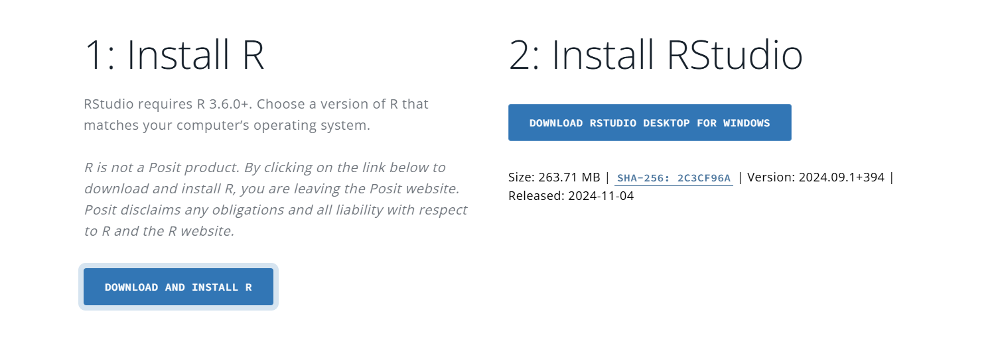
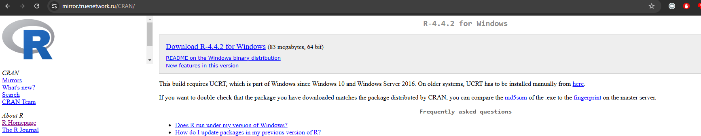
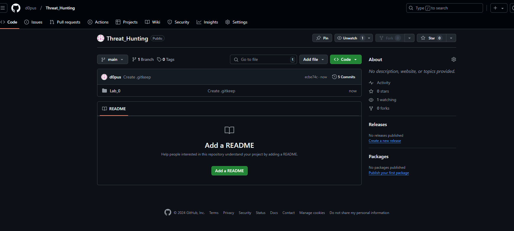
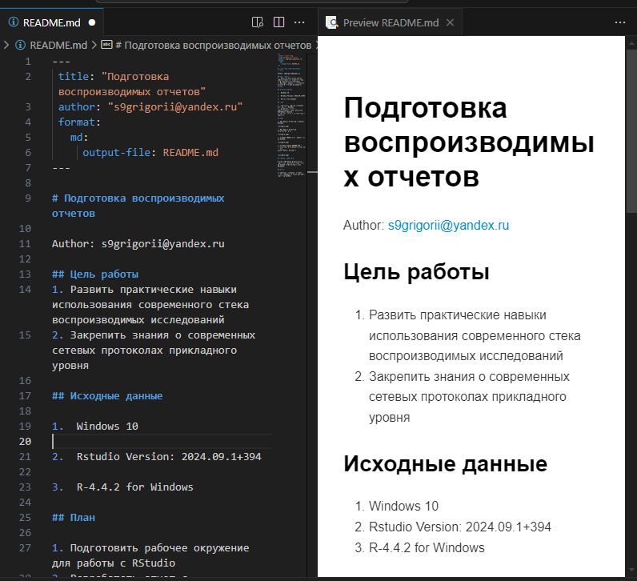
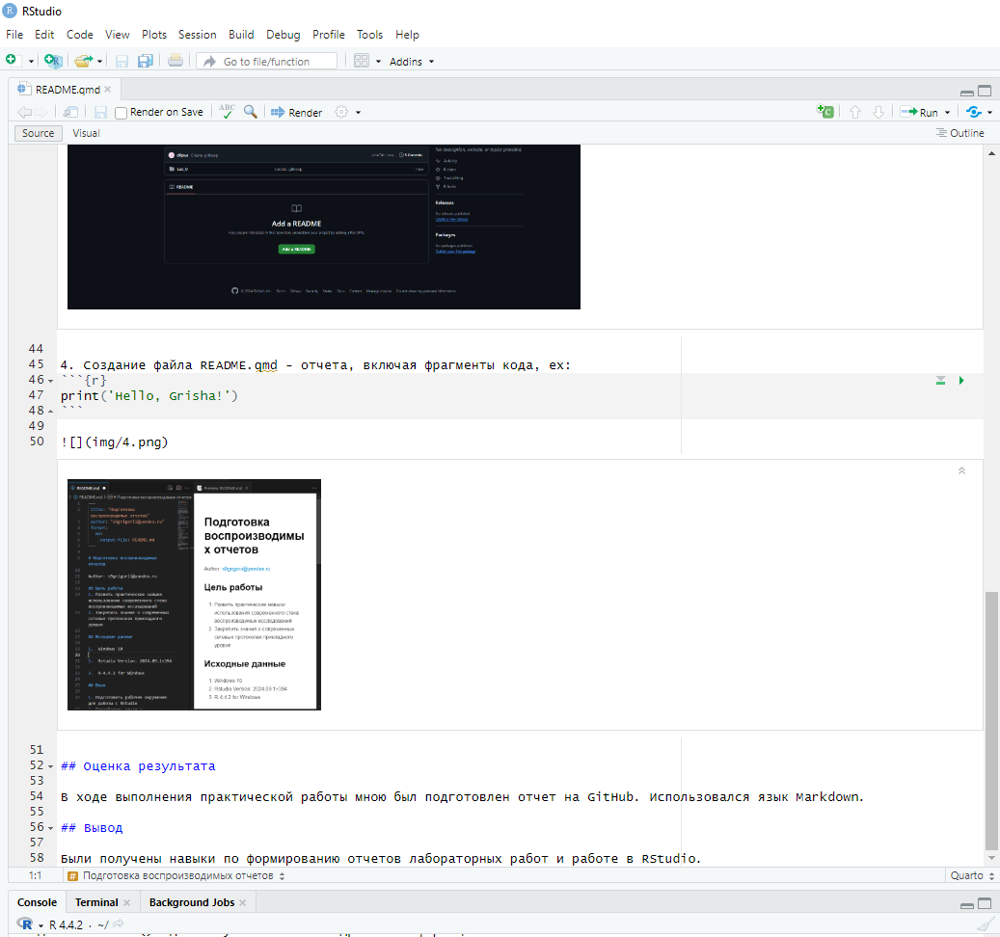

# Подготовка воспроизводимых отчетов

Author: s9grigorii@yandex.ru

## Цель работы

1.  Развить практические навыки использования современного стека
    воспроизводимых исследований
2.  Закрепить знания о современных сетевых протоколах прикладного уровня

## Исходные данные

1.  Windows 10

2.  Rstudio Version: 2024.09.1+394

3.  R-4.4.2 for Windows

## План

1.  Подготовить рабочее окружение для работы с RStudio
2.  Разработать отчет с использованием стека технологий Rmarkdown и
    Quarto
3.  Оформить отчет в соответствии с шаблоном

## Шаги

1.  Загрузка и установка окружения RStudio.



1.  Загрузка и установка интерпретатора R.



1.  Создание публичного репозитория на GitHub.



1.  Создание файла README.md и README.qmd - отчета, включая фрагменты
    кода, ex:

``` r
print('Hello, Grisha!')
```

    [1] "Hello, Grisha!"

 

## Оценка результата

В ходе выполнения практической работы мною был подготовлен отчет на
GitHub. Использовался язык Markdown.

## Вывод

Были получены навыки по формированию отчетов лабораторных работ и работе
в RStudio.
