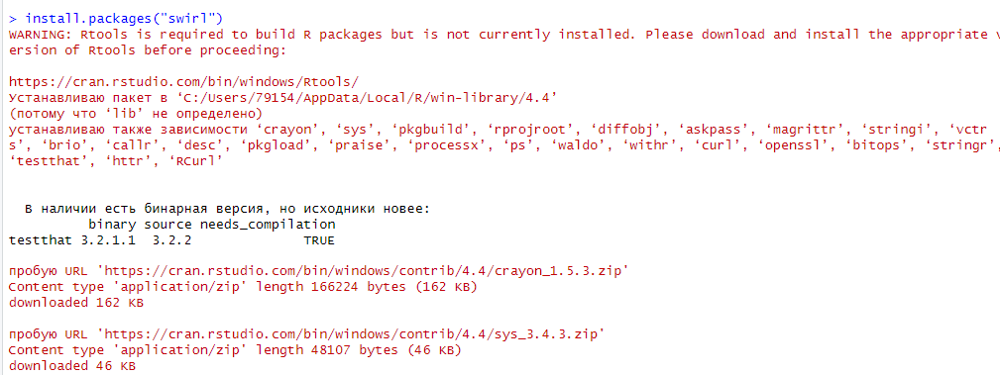
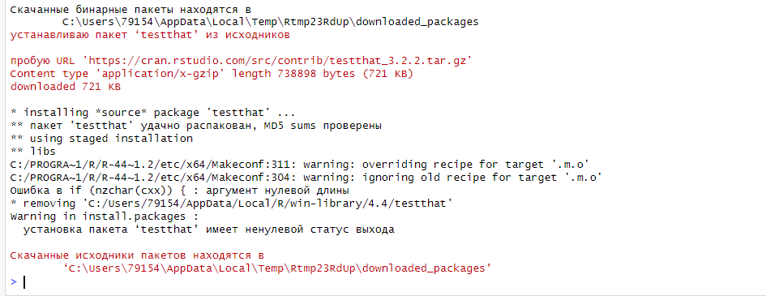
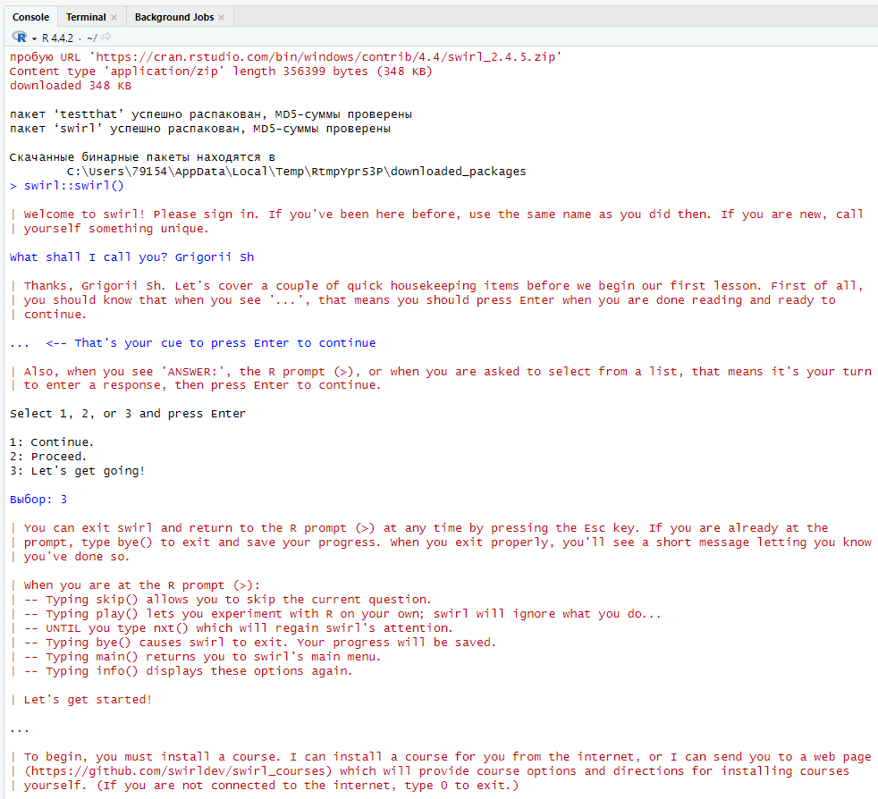
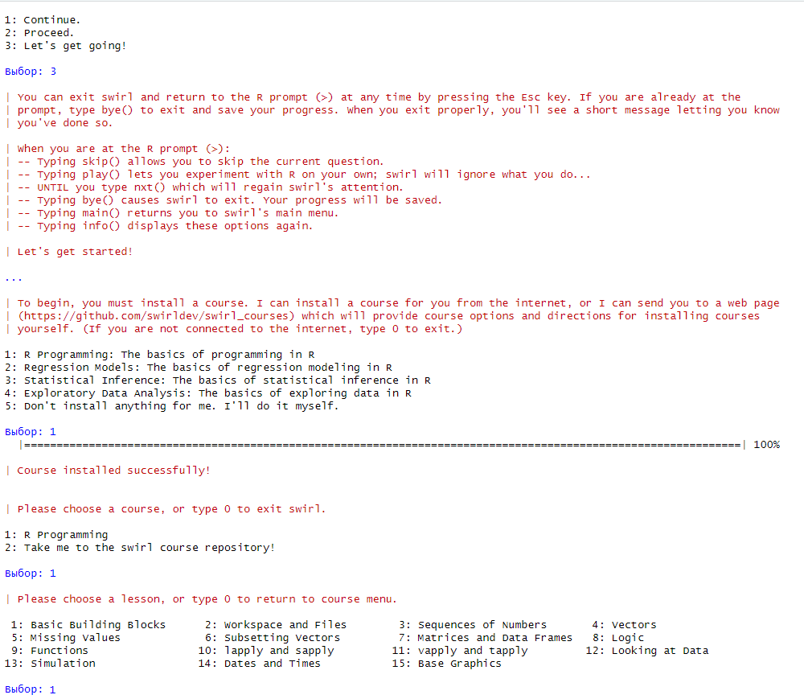
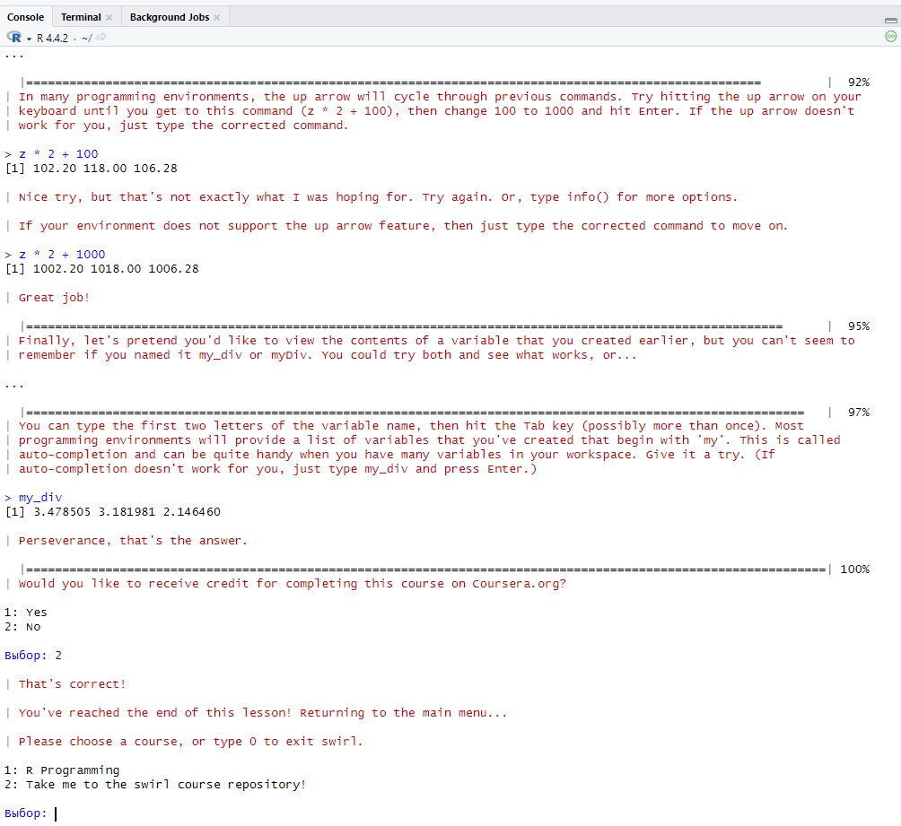
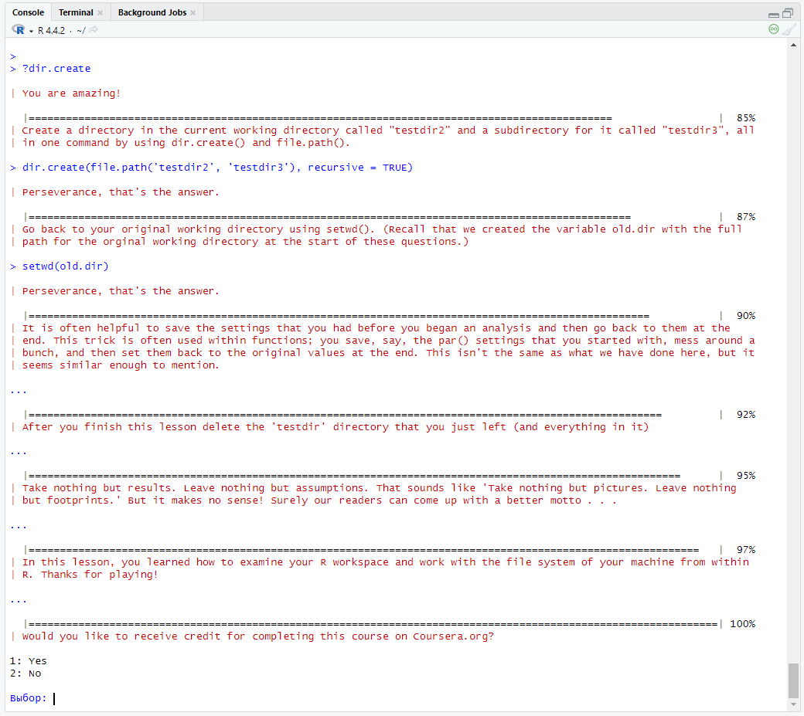
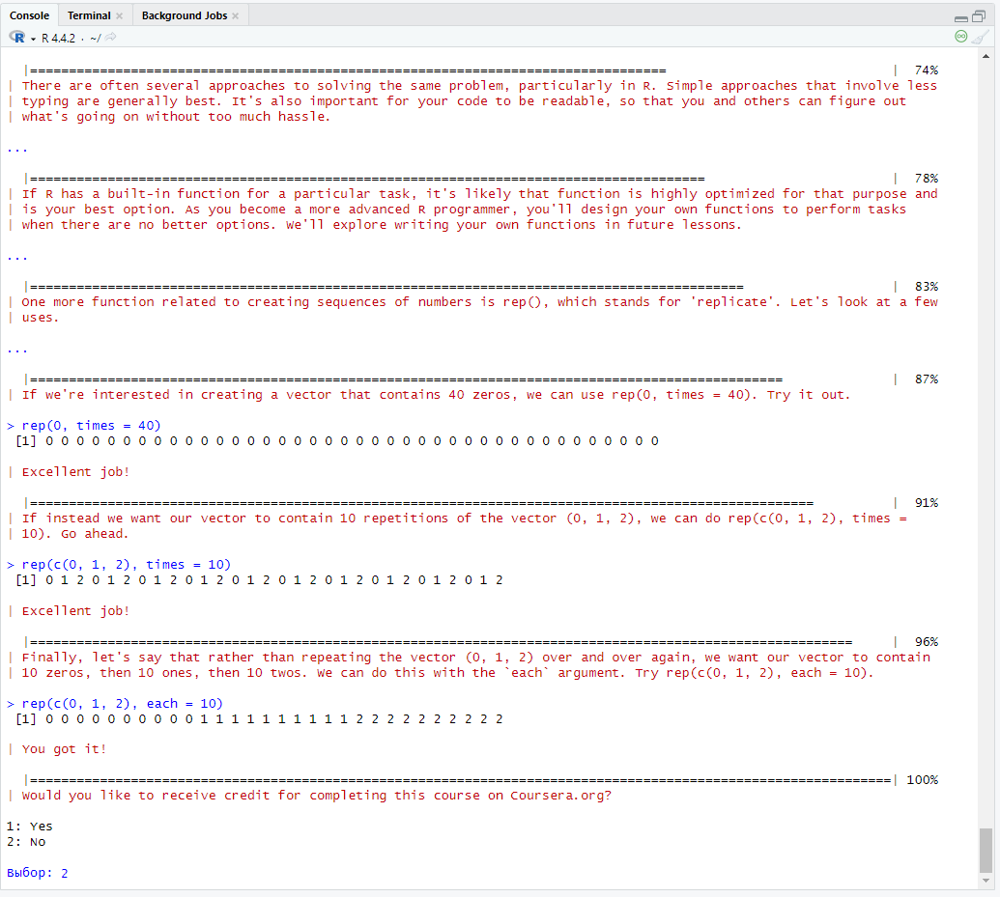
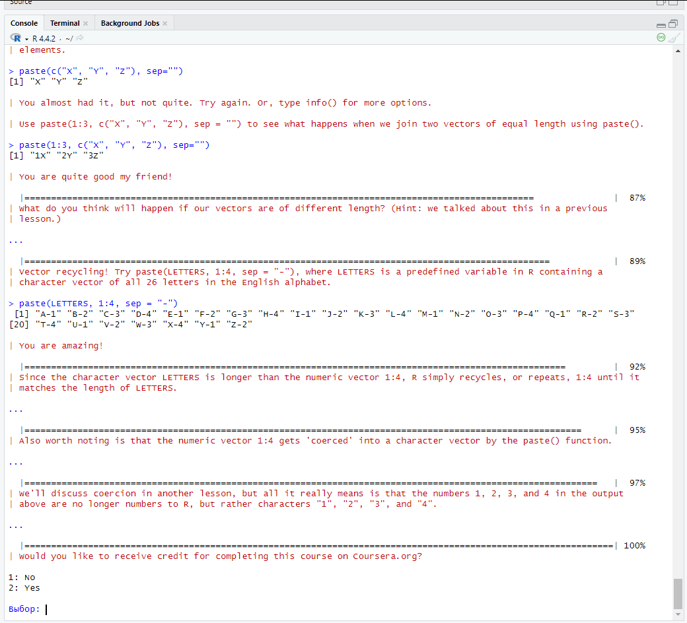
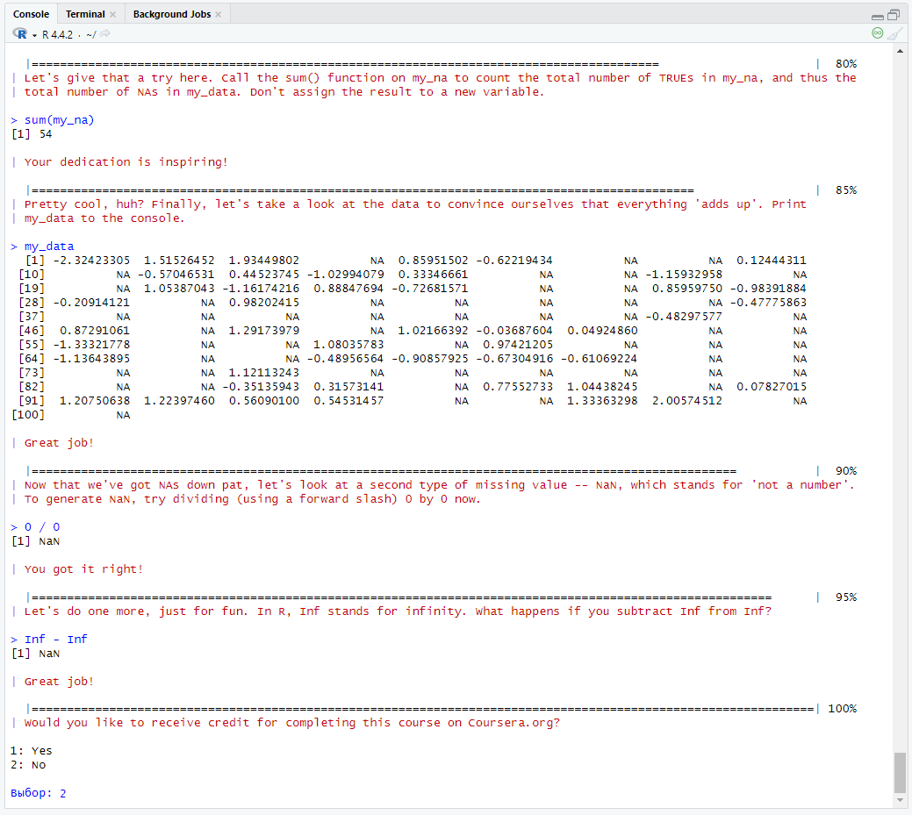

# Введение в R
s9grigorii@yandex.ru

# Введение в R

## Цель работы

1.  Развить практические навыки использования языка программирования R
    для обработки данных
2.  Развить навыки работы в Rstudio IDE: установка пакетов работа с
    проектами в Rstudio настройка и работа с Git
3.  Закрепить знания базовых типов данных языка R и простейших операций
    с ними

## Исходные данные

1.  Windows 10

2.  Rstudio Version: 2024.09.1+394

3.  R-4.4.2 for Windows

## План

1.  Подготовить рабочее окружение для работы с RStudio
2.  Разработать отчет с использованием стека технологий Rmarkdown и
    Quarto
3.  Оформить отчет в соответствии с шаблоном

## Шаги

1.  Установить программный пакет swirl: функцией R
    install.packages(“swirl”). Также все недостающие пакеты.





1.  Запустить задание с помощью swirl::swirl()

    ::: {.cell}

    ``` r
    'swirl::swirl()'
    ```

    ::: {.cell-output .cell-output-stdout}

        [1] "swirl::swirl()"

    ::: :::



1.  Выбрать из меню курсов 1. R Programming: The basics of programming
    in R



1.  Запустить подкурсы и выполнить:

    1.  Базовые структурные блоки (Basic Building Blocks)

        

    2.  Рабочие пространства и файлы (Workspace and Files)

        

    3.  Последовательности чисел (Sequences of Numbers)

        

    4.  Векторы (Vectors)

        

    5.  Пропущенные значения (Missing Values)

        

2.  Составить отчет и выложить его и исходный qmd/rmd файл в свой
    репозиторий

## Оценка результата

В ходе выполнения практической работы была установлена библиотека swirl,
пройдены 5 тем из курса “R Programming: The basics of programming in R”.

## Вывод

Так, мною была изучена база языка R: Basic Building Blocks, Workspace
and Files, Sequences of Numbers, Vectors, Missing Values.
