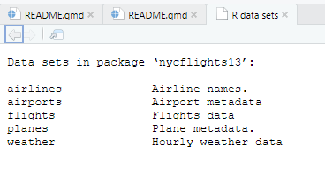
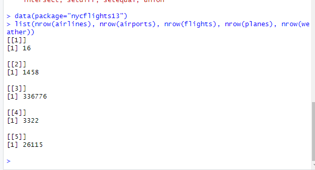
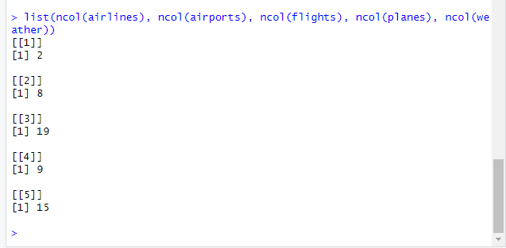
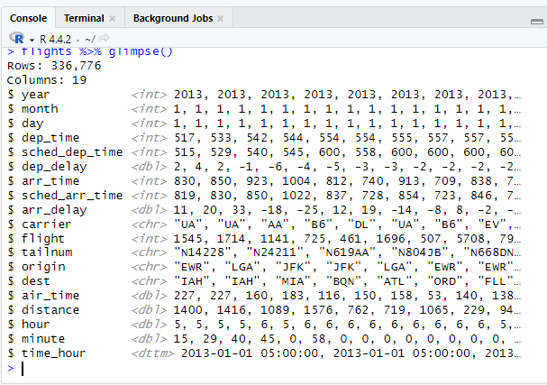
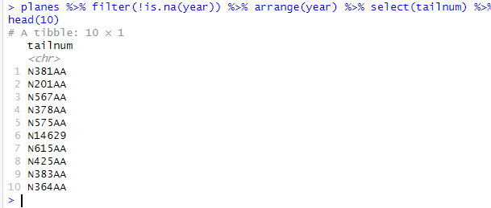
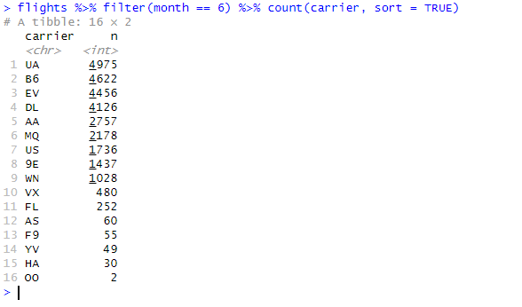
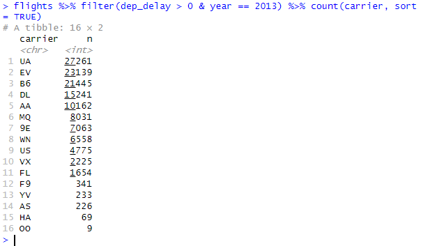

# Основы обработки данных с помощью R и Dplyr 
 
## Цель работы 
 
1. Изучить возможности технологии Yandex DataLens для визуального анализа структурированных наборов данных
2. Получить навыки визуализации данных для последующего анализа с помощью сервисов Yandex Cloud
3. Получить навыки создания решений мониторинга/SIEM на базе облачных продуктов и открытых программных решений
4. Закрепить практические навыки использования SQL для анализа данных сетевой активности в сегментированной корпоративной сети
  
## Исходные данные 
 
1.  Windows 10

2.  Rstudio Version: 2024.09.1+394
    
3.  R-4.4.2 for Windows

## План

1. Проверка данных в бакете.

2. Выполнение трех заданий
 
## Шаги

1.  Для начала прохождения курса необходимо установить программный пакет nycflights13

```{r}
#install.packages('nycflights13')
```

2. Далее подключаем библиотеки nycflights13 и dplyr.

```{r}
library(nycflights13)
library(dplyr)
```

3. Выполнение заданий.
3.1 Сколько встроенных в пакет nycflights13 датафреймов?
```{r}
data(package="nycflights13")
```


3.2 Сколько строк в каждом датафрейме?
```{r}
list(nrow(airlines), nrow(airports), nrow(flights), nrow(planes), nrow(weather))
```


3.3 Сколько столбцов в каждом датафрейме?
```{r}
list(ncol(airlines), ncol(airports), ncol(flights), ncol(planes), ncol(weather))
```


3.4 Как просмотреть примерный вид датафрейма?
```{r}
flights %>% glimpse()
```


3.5 Сколько компаний-перевозчиков (carrier) учитывают эти наборы данных (представлено в наборах данных)?
```{r}
flights %>% filter(!is.na(carrier)) %>% distinct(carrier) %>% nrow()
```


3.6 Сколько рейсов принял аэропорт John F Kennedy Intl в мае?
```{r}
flights %>% filter(origin == "JFK", month == 5) %>% nrow()
```


3.7 Какой самый северный аэропорт?
```{r}
airports %>% arrange(desc(lat)) %>% head(1) %>% select(name)
```


3.8 Какой аэропорт самый высокогорный (находится выше всех над уровнем моря)?
```{r}
airports %>% arrange(desc(alt)) %>% head(1) %>% select(name)
```


3.9 Какие бортовые номера у самых старых самолетов?
```{r}
planes %>% filter(!is.na(year)) %>% arrange(year) %>% select(tailnum) %>% head(10)
```


3.10 Какая средняя температура воздуха была в сентябре в аэропорту John F Kennedy Intl (в градусах Цельсия).
```{r}
weather %>% filter(origin == "JFK", month == 9) %>% summarise(avg_temp = mean((temp - 32) * 5 / 9, na.rm = TRUE))
```


3.11 Самолеты какой авиакомпании совершили больше всего вылетов в июне?
```{r}
flights %>% filter(month == 6) %>% count(carrier, sort = TRUE)
```


3.12 Самолеты какой авиакомпании задерживались чаще других в 2013 году?
```{r}
flights %>% filter(dep_delay > 0 & year == 2013) %>% count(carrier, sort = TRUE)
```



## Оценка результата
  
В ходе выполнения практической работы была использована библиотека (набор данных) nycflights13 и drlyr.

## Вывод 

Так, мною был проанализирован набор данных nycflights13  с использованием функций, изученных ранее.
```{r}

```