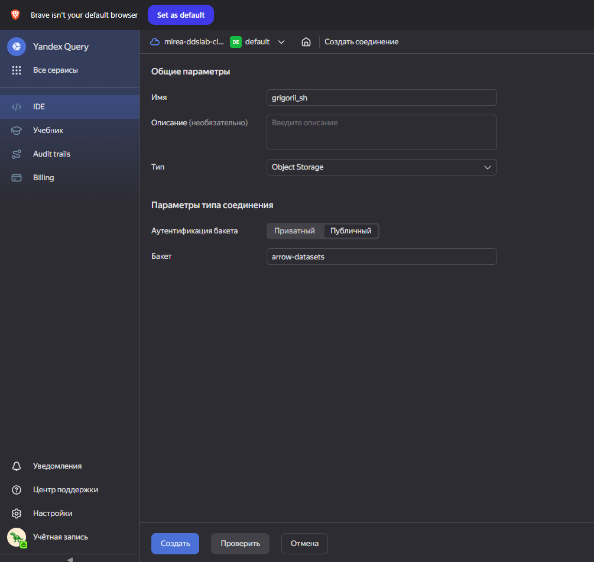

# Использование технологии Yandex Query для анализа данных сетевой активности 
 
## Цель работы 
 
1. Изучить возможности технологии Yandex DataLens для визуального анализа структурированных наборов данных
2. Получить навыки визуализации данных для последующего анализа с помощью сервисов Yandex Cloud
3. Получить навыки создания решений мониторинга/SIEM на базе облачных продуктов и открытых программных решений
4. Закрепить практические навыки использования SQL для анализа данных сетевой активности в сегментированной корпоративной сети
  
## Исходные данные 
 
1.  Windows 10

2.  Yandex Cloud

3. Arrow dataset

## План

1. Проверка данных в бакете.

2. Выполнение трех заданий
 
## Шаги

1.  Присоединение к организации.


2. Проверка доступности с использованием сконструированного URL.


3. Cоздание соединения по имени.



4. Проверка датасета.

5. Выполнение задания 1.


```
SELECT
count(DISTINCT src) counter
FROM `grigorii_sh_dataset`
WHERE src LIKE  '12.%'  OR src LIKE  '13.%'  OR src LIKE  '14.%'
```
6. Выполнение задания 2.

```
SELECT sum(bytes) sum1
FROM `grigorii_sh_dataset`
WHERE  (src LIKE  '12.%'  OR src LIKE  '13.%'  OR src LIKE  '14.%')  AND  (dst NOT  LIKE  '12.%'  AND dst NOT  LIKE  '13.%'  AND dst NOT  LIKE  '14.%')
```
7. Выполнение задания 3.

```
SELECT  sum(bytes) sum2
FROM  `grigorii_sh_dataset`
WHERE  (dst LIKE  '12.%'  OR dst LIKE  '13.%'  OR dst LIKE  '14.%')  and  (src NOT  LIKE  '12.%'  AND src NOT  LIKE  '13.%'  AND src NOT  LIKE  '14.%')
```

## Оценка результата
  
В ходе выполнения практической работы были выполнены задания с бакетом arrow-datasets. 
## Вывод 

Так, мною были изучены инструменты Yandex Query для обработки и анализа данных с помощью SQL-запросов.
```{r}

```
 