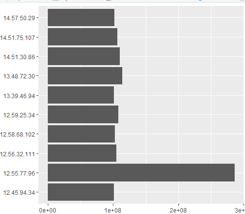

# Анализ данных сетевого трафика при помощи библиотеки Arrow
 
## Цель работы 
 
1. Изучить возможности технологии Apache Arrow для обработки и анализ больших данных
2. Получить навыки применения Arrow совместно с языком программирования R
3. Получить навыки анализа метаинфомации о сетевом трафике
4. Получить навыки применения облачных технологий хранения, подготовки и анализа данных: Yandex Object Storage, Rstudio Server.
  
## Исходные данные 
 
1.  Windows 10
    
2.  Rstudio Version: 2024.09.1+394
    
3.  R-4.4.2 for Windows

## План

1.  Импортировать данные

2.  Выполнить 3 задания
 
## Шаги

1. Подготовка (импорт).

```{r}
install.packages("arrow")

library(arrow)

system("curl -O https://storage.yandexcloud.net/arrow-datasets/tm_data.pqt")

library(dplyr)

data22 <- read_parquet("tm_data.pqt", use_threads=False)

library(tidyverse)

library(ggplot2)
```

2. Выполнение заданий.

2.1 Найдите утечку данных из Вашей сети.

##### 	Важнейшие документы с результатами нашей исследовательской деятельности в области создания вакцин скачиваются в виде больших заархивированных дампов. Один из хостов в нашей сети используется для пересылки этой информации – он пересылает гораздо больше информации на внешние ресурсы в Интернете, чем остальные компьютеры нашей сети. Определите его IP-адрес.

```{r}
internal_traffic <- data22 %>% filter(grepl("^12\\.|^13\\.|^14\\.", src)) %>% filter(!grepl("^12\\.|^13\\.|^14\\.", dst)) > summary_traffic <- internal_traffic %>% group_by(src) %>% summarise(total_bytes_sent = sum(bytes, na.rm = TRUE)) %>% arrange(desc(total_bytes_sent))

iptop <- head(summary_traffic, 1)

View(iptop)
```


2.2 Найдите утечку данных 2.

##### 	Другой атакующий установил автоматическую задачу в системном планировщике cron для экспорта содержимого внутренней wiki системы. Эта система генерирует большое количество трафика в нерабочие часы, больше чем остальные хосты. Определите IP этой системы. Известно, что ее IP адрес отличается от нарушителя из предыдущей задачи.

```{r}
hourly_traffic <- internal_traffic %>% select(timestamp, src, dst, bytes)%>%mutate(time=hour(as_datetime(timestamp/1000))) %>% filter(time>=0&time<=24) %>% group_by(time)%>%summarise(trafictime=n())%>% arrange(desc(time))

View(hourly_traffic)
```


```{r}
ggplot(data = hourly_traffic, aes(x = time, y = trafictime)) + + geom_line() + +     geom_point()
```


```{r}
traffic_noWork <- internal_traffic %>% mutate( + time=hour(as_datetime(timestamp/1000)) + ) %>% + filter( + time >= 1 & time <= 15, + src != '13.37.84.125' + ) %>% + group_by(src) %>% + summarise( + total_bytes = sum(bytes) + ) %>% +     arrange(desc(total_bytes))

ggplot(head(traffic_noWork, 10), aes(total_bytes, src)) + geom_col()
```



2.3 Найдите утечку данных 3.

##### 	Еще один нарушитель собирает содержимое электронной почты и отправляет в Интернет используя порт, который обычно используется для другого типа трафика. Атакующий пересылает большое количество информации используя этот порт, которое нехарактерно для других хостов, использующих этот номер порта. Определите IP этой системы. Известно, что ее IP адрес отличается от нарушителей из предыдущих задач.

```{r}
ports <- internal_traffic %>% + filter(src != '13.37.84.125' & src != '12.55.77.96') %>% + group_by(port) %>% + summarise( + mean_bytes = mean(bytes), + max_bytes = max(bytes), + sum_bytes = sum(bytes), + Raz = max_bytes - mean_bytes + ) %>% + filter(Raz != 0) %>% +     arrange(desc(Raz))

ggplot(data = ports, aes(x = port, y = Raz)) + geom_col()
```


```{r}
result <- internal_traffic %>% + filter(port == 37) %>% +     group_by(src) %>% summarise(traffic = sum(bytes), count = n(), avg = traffic/count, med = median(bytes)) %>% arrange(desc(avg))

ggplot(head(result, 10), aes(avg, src)) + geom_col()
```


## Оценка результата
  
В ходе выполнения практической работы были изучены возможности технологии Apache Arrow для работы с большими данными. Также получены навыки анализа метаинформации о сетевом трафике и работы с облачными технологиями, такими как Yandex Object Storage и RStudio Server. Были выполнены задания по анализу данных, что позволило закрепить теоретические знания на практике.

## Вывод 

Так, мною был освоен инструмент Apache Arrow для обработки больших данных, изучены методы анализа сетевого трафика и работы с облачными платформами.
```{r}

```
