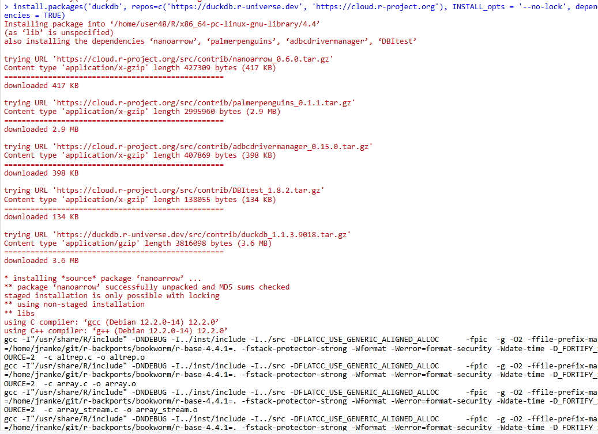
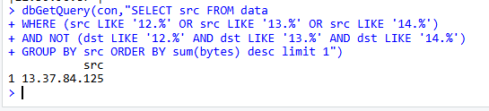
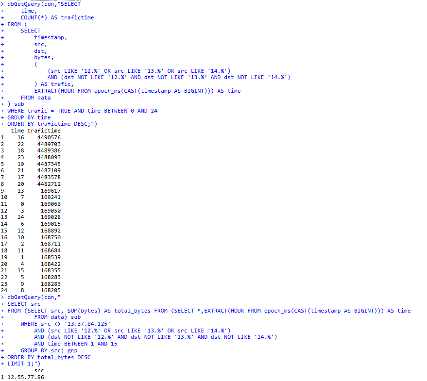
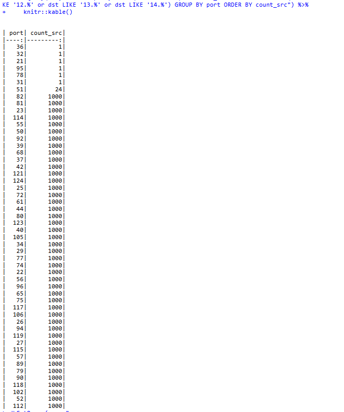
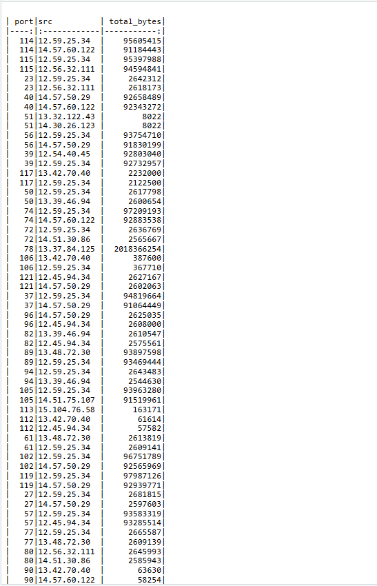
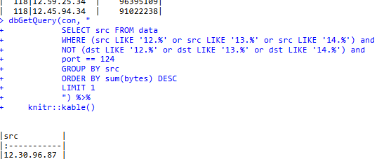

# Анализ данных сетевого трафика с использованием аналитической in-memory СУБД DuckDB
 
 
## Цель работы 
 
1. Изучить возможности СУБД DuckDB для обработки и анализ больших данных

2. Получить навыки применения DuckDB совместно с языком программирования R

3. Получить навыки анализа метаинфомации о сетевом трафике

4. Получить навыки применения облачных технологий хранения, подготовки и анализа данных: Yandex Object Storage, Rstudio Server.
  
## Исходные данные 
 
1.  Windows 10

2.  Rstudio Version: 2024.09.1+394

3. Yandex Cloud

4.  DuckDB, dplyr

## План

1. Подключение к rstudio server по приватному ключу.

2. Компиляция библиотек.

3. Выполнение трех заданий.
 
## Шаги

1.  Загрузка данных и DuckDB.
    ```
    download.file("https://storage.yandexcloud.net/arrow-datasets/tm_data.pqt",destfile = "tm_data.pqt")

    install.packages('duckdb', repos=c('https://duckdb.r-universe.dev', 'https://cloud.r-project.org'), INSTALL_opts = '--no-lock', dependencies = TRUE)
    ```

2. Загрузка данных в таблицу data:
```{r}
library(duckdb)
library(dplyr)
library(DBI)
library(ggplot2)
>con <- dbConnect(duckdb::duckdb())
>query <- "CREATE TABLE data AS SELECT * FROM read_parquet('tm_data.pqt');"
>dbExecute(con,query)
```
3.1. Задание 1.
```{r}
dbGetQuery(con,"SELECT src FROM data + WHERE (src LIKE '12.%' OR src LIKE '13.%' OR src LIKE '14.%') + AND NOT (dst LIKE '12.%' AND dst LIKE '13.%' AND dst LIKE '14.%') + GROUP BY src ORDER BY sum(bytes) desc limit 1")
```


3.2. Задание 2.
```{r}
dbGetQuery(con,"SELECT + time, + COUNT(*) AS trafictime + FROM ( + SELECT + timestamp, + src, + dst, + bytes, + ( + (src LIKE '12.%' OR src LIKE '13.%' OR src LIKE '14.%') + AND (dst NOT LIKE '12.%' AND dst NOT LIKE '13.%' AND dst NOT LIKE '14.%') + ) AS trafic, + EXTRACT(HOUR FROM epoch_ms(CAST(timestamp AS BIGINT))) AS time + FROM data + ) sub + WHERE trafic = TRUE AND time BETWEEN 0 AND 24 + GROUP BY time + ORDER BY trafictime DESC;")
```
```{r}
dbGetQuery(con," + SELECT src + FROM (SELECT src, SUM(bytes) AS total_bytes FROM (SELECT *,EXTRACT(HOUR FROM epoch_ms(CAST(timestamp AS BIGINT))) AS time + FROM data) sub + WHERE src <> '13.37.84.125' + AND (src LIKE '12.%' OR src LIKE '13.%' OR src LIKE '14.%') + AND (dst NOT LIKE '12.%' AND dst NOT LIKE '13.%' AND dst NOT LIKE '14.%') + AND time BETWEEN 1 AND 15 + GROUP BY src) grp + ORDER BY total_bytes DESC + LIMIT 1;")
```


3.3. Задание 3.
```{r}
dbGetQuery(con, "SELECT port, count(DISTINCT src) as count_src FROM data WHERE (src LIKE '12.%' or src LIKE '13.%' or src LIKE '14.%') and NOT (dst LIKE '12.%' or dst LIKE '13.%' or dst LIKE '14.%') GROUP BY port ORDER BY count_src") %>% +     knitr::kable()
```
```{r}
dbGetQuery(con, " + WITH ranked_src AS (SELECT port, src, SUM(bytes) AS total_bytes,ROW_NUMBER() OVER (PARTITION BY port ORDER BY SUM(bytes) DESC) AS rn + FROM data + GROUP BY port, src + ) + SELECT port, src, total_bytes FROM ranked_src WHERE rn <= 2") %>% +     knitr::kable()
```
```{r}
dbGetQuery(con, " + SELECT src FROM data + WHERE (src LIKE '12.%' or src LIKE '13.%' or src LIKE '14.%') and + NOT (dst LIKE '12.%' or dst LIKE '13.%' or dst LIKE '14.%') and + port == 124 + GROUP BY src + ORDER BY sum(bytes) DESC + LIMIT 1 + ") %>% +     knitr::kable()
```




## Оценка результата
  
В ходе выполнения практической работы был проведен анализ пакета tm_data.pqt с помощью DuckDB. 
## Вывод 

Так, мною были изучены инструменты обработки и анализа больших данных, сетевого трафика и получения метаинформации.
```{r}

```
 
